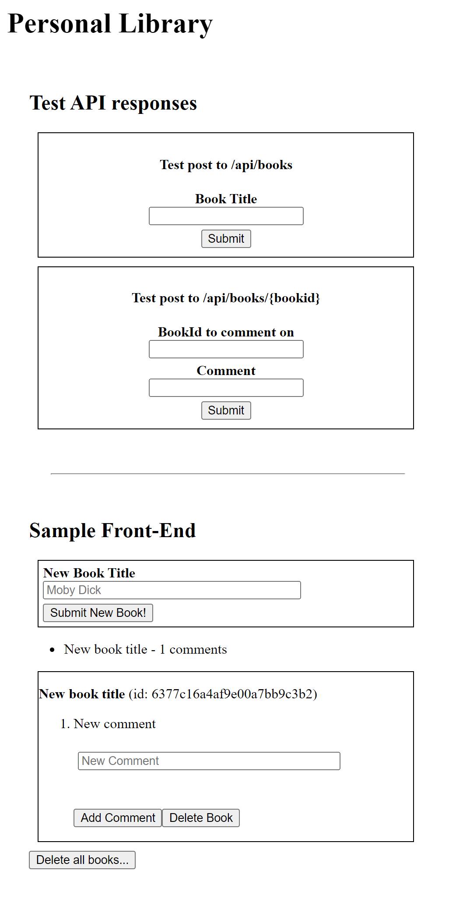

# [freeCodeCamp Quality Assurance certification](https://www.freecodecamp.org/learn/quality-assurance/)

## [Personal Library](https://www.freecodecamp.org/learn/quality-assurance/quality-assurance-projects/personal-library)

Working example: http://app-personal-library.webdev.priv.pl/

My git repo: https://github.com/Raff1010X/01.Roadmap

